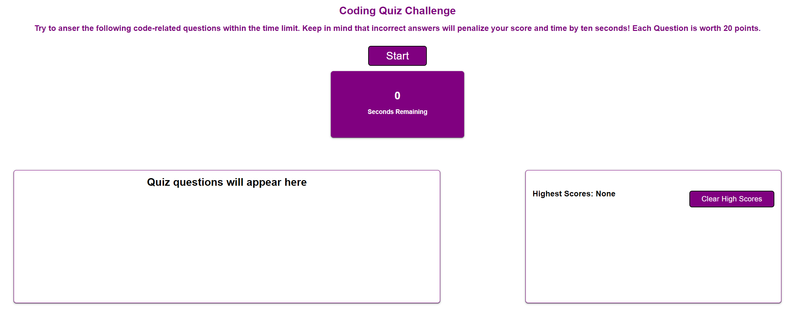

# <Challenge-4>

## Description

Provide a short description explaining the what, why, and how of your project. Use the following questions as a guide:

- The motivation for this project was to create API Quiz to test the knowledge of maing a full application. 
- I built this project in order to provide a seemless way integrate Java and HTML togather to creat the most interactive quiz to date.  
- What problem does it solve:
GIVEN I am taking a code quiz
WHEN I click the start button
THEN a timer starts and I am presented with a question
WHEN I answer a question
THEN I am presented with another question
WHEN I answer a question incorrectly
THEN time is subtracted from the clock
WHEN all questions are answered or the timer reaches 0
THEN the game is over
WHEN the game is over
THEN I can save my initials and score
- I learned how to use Javascript to interact with the webpage and have both HTML, CSS, and Javascript work together. 

- [Installation](#installation) N/A
- [Usage](#usage) N/A
- [Credits](#credits) None
- [License](#license) MIT

## Installation

Deployed on the github pages 

## Usage

Link to the website can be found here: https://bulkingfire.github.io/Stathatos_Challenge4/
Screenshot:

## Credits

None

## License

MIT

---

🏆 The previous sections are the bare minimum, and your project will ultimately determine the content of this document. You might also want to consider adding the following sections.
